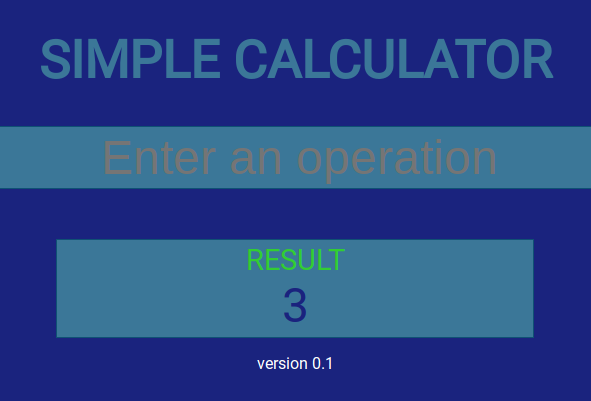

Jasmine Simple Calculator

#### Description ####
A Simple Calculator with Jasmine framework for  Unit testing built in JavaScript.

Uses a headless browser from the CL to run unit test.

#### Usage ####
1. clone or download the repo.
2. Run **npm install** to install dependencies.
3. To use the calculator, open simple-calculator.html in a browser.

###### Jasmine Unit Testing ######
1. From the CL run **karma start**. A new directory coverage will be created. 
2. To view the test results, navigate to **coverage**/index.html and open in your browser.

##### Author #####
Nathan Malone

